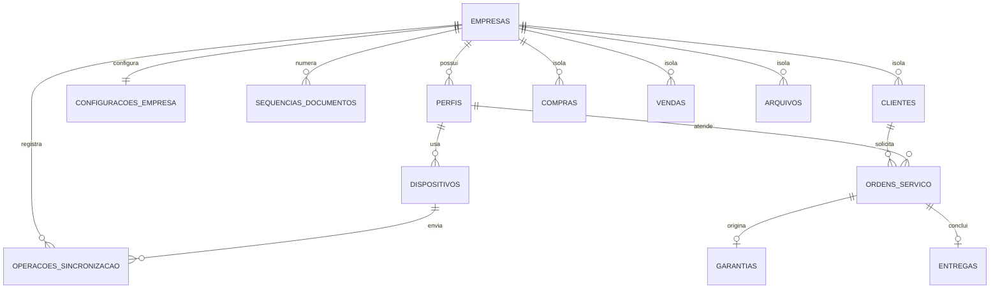

# Etapa 2 — Modelo relacional do Supabase

Este documento define o contrato do banco. Ele não ativa Supabase no APK ou no Electron e não remove Firebase/Cloudinary.

## Modelo



Todas as tabelas de negócio carregam `empresa_id`. As referências importantes usam chaves compostas `(empresa_id, id)`, impedindo que uma OS da empresa A aponte para cliente, técnico ou dispositivo da empresa B.

## Decisões tomadas a partir do banco real do PC

- `garantias` continua como entidade própria, vinculada 1:1 à OS. O banco local atual já mantém esse documento separado e possui seus próprios prazo, termos e PDF.
- `entregasPendentes` e `entregas` não viraram duas tabelas. São uma entidade `entregas` com estados `pendente_assinatura`, `concluida` ou `cancelada`. Isso elimina duplicação sem perder o fluxo atual.
- `clientes` passa a ser a referência canônica, enquanto OS, garantia, entrega e venda conservam snapshots necessários para documentos históricos.
- `id_exportacao` continua único por empresa e é usado para idempotência.
- compras e vendas possuem tabelas próprias porque já existem como coleções transacionais no ERP.
- fotos, assinaturas, PDFs e comprovantes nunca entram no PostgreSQL como Base64. `arquivos` guarda somente categoria, MIME, tamanho, caminhos, origem e disponibilidade.

## Numeração e concorrência

`public.criar_ordem_servico`:

1. deriva a empresa de `auth.uid()`;
2. valida usuário, empresa, licença e permissão;
3. devolve a OS existente quando `id_exportacao` já foi processado;
4. incrementa `sequencias_documentos` por `INSERT ... ON CONFLICT DO UPDATE ... RETURNING` dentro da mesma transação;
5. grava `OS-0001`, `OS-0002` etc. com `UNIQUE (empresa_id, numero)` e `UNIQUE (empresa_id, numero_sequencial)`.

O frontend não envia `empresa_id`, número oficial nem `revision` inicial.

## Conflitos e exclusão

As entidades sincronizadas iniciam com `revision = 1`. O trigger incrementa a revisão e `updated_at` em todo update. A RPC `atualizar_ordem_servico` só altera a linha quando a revisão esperada coincide; caso contrário retorna SQLSTATE `40001` com `conflito_revision`.

`excluir_ordem_servico` preenche `deleted_at`. Não existe policy de `DELETE` físico para as tabelas de negócio.

## Consultas leves

- `vw_ordens_servico_leve`
- `vw_garantias_leve`
- `vw_entregas_leve`
- `vw_clientes_leve`
- `vw_compras_leve`
- `vw_vendas_leve`

As views têm colunas explícitas, usam `security_invoker = true` e respeitam RLS das tabelas de origem. Elas retornam contadores/indicadores de arquivos, nunca bytes, Base64, fotos, PDFs, assinaturas ou termos extensos.

## Arquivos

Buckets privados:

- `miniaturas`
- `arquivos-os`
- `documentos-pdf`

O caminho sempre começa com o UUID da empresa:

```text
empresa_id/os/os_id/foto_id-thumb.webp
empresa_id/os/os_id/foto_id.webp
empresa_id/garantias/garantia_id/arquivo_id.webp
empresa_id/entregas/entrega_id/arquivo_id.pdf
```

As policies verificam o primeiro segmento com `storage.foldername(name)`. `legacy_cloudinary_url` preserva o fallback existente; URL assinada do Supabase não é persistida.

## Licença e segurança

A regra conservadora desta etapa bloqueia acesso quando usuário/empresa estão inativos, a licença está `bloqueada`/`vencida`, ou `licenca_expira_em` passou. Essa decisão está centralizada em `app_private.current_user_empresa_id()`.

As funções `SECURITY DEFINER` usam `search_path = ''`, objetos qualificados e schema privado. `anon` não recebe policy nem execução de RPC. A chave `service_role` não aparece no código cliente.

## Compatibilidade gradual

O seed mantém as flags iniciais:

```json
{
  "cloudProvider": "firebase",
  "fileProvider": "cloudinary",
  "supabaseAtivo": false
}
```

Assim, esta etapa instala somente o contrato de backend. A ativação de login começa na Etapa 3; consultas leves e fallback só mudam a partir da Etapa 4.
